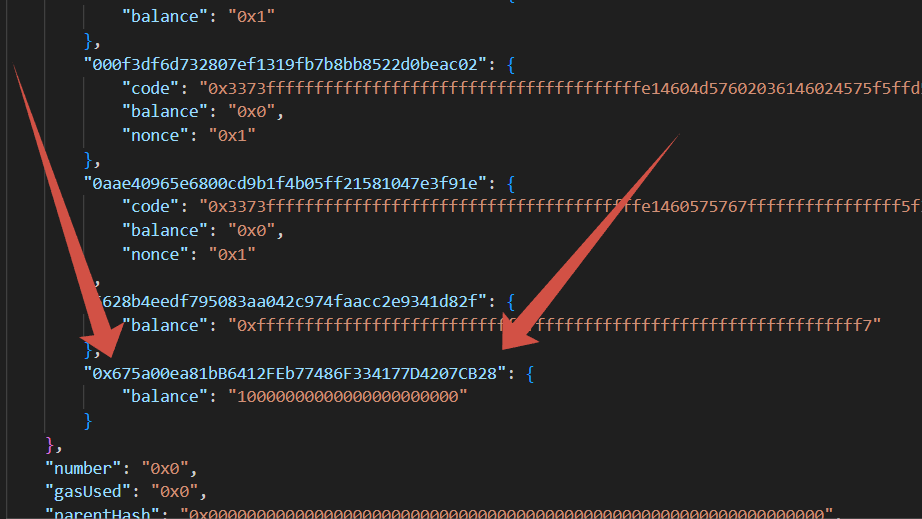
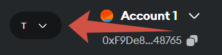

# Safe road traffic

## I use:
1. <a href="https://vite.dev/guide">Vite + ReactJS</a>  
2. <a href="https://www.npmjs.com/package/web3">npm Web3</a>
3. <a href="https://geth.ethereum.org/downloads">Go-Ethereum v1.14.11(installer)</a> 
4. <a href="https://metamask.io/">MetaMask</a>

-----------
## The Frontend. Start command:
```cmd
git clone https://github.com/Muraddddddddd9/safe_road_traffic.git
```
```npm
npm i
```
```npm
npm run dev
```

-----------
## Create smart-contract on Solidity 
1. Open the Remix IDE
2. Create the Users.sol file
3. Insert the code from the Users.sol file there

-----------
## The Backend. Start command:
### Creating a local server:
1. Create any folder on your desktop
2. Log in to the created folder
3. Open CMD and input: <br>
    3.1 Running the testnet with the default configuration: 
    ```cmd 
    geth --datadir "" --dev
    ```
    3.2 Uploading the genesis json configuration from the network: 
    ```cmd 
    geth --datadir "" --dev dumpgenesis > genesis.json
    ```
    3.3 Creating an account 
    ```cmd 
    geth --datadir "" account new 
    ```
    3.4 Add to genesis.json account as shown in the picture 1<br>
    <br>
    3.4 Delete the created *geth* folder<br>
    3.5 Network initialization with its own configuration 
    ```cmd
    geth --datadir "" init genesis.json
    ```
    3.6 Raising the net
    ```cmd
    geth --datadir "" --dev --http --http.api "net,eth,web3" --http.corsdomain "*" --http.port 8545 --networkid 1337
    ```

### Creating a test server in MetaMask:
1. Creating a wallet
2. In the right corner, click on the icon and go to the network selection. <br>
 <br>
3. We enter the necessary data <br>
    3.1 Network name: any name <br>
    3.2 URL-address: http://localhost:8545 <br>
    3.3 ID-blockchane: 1337 <br>
    3.4 Currency symbol: ETH <br>
    3.5 Save <br>
4. Go to the wallet selection <br> 
5. Add an invoice <br>
6. Import the invoice and select the type of JSON-file <br>
7. Import keystore wallets inside your created folder <br>

### Start work
1. Open the Deploy and Run Transactions tab in the Remix IDE
2. We select in the Environment MetaMask
3. Click on the Deploy button
4. Copying the address of the smart contract
5. We insert it into the contractAddress inside the src/Services/Services file.js copied address